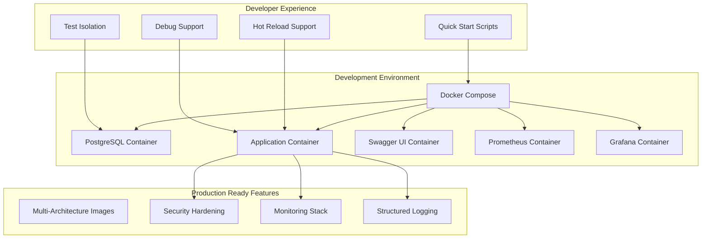

# Design Document

## Overview

This design enhances the existing Docker setup for ToTrackIt to provide a world-class open source experience. The enhancement focuses on developer experience, production readiness, security, and observability while maintaining the simplicity that makes open source projects accessible.

The design builds upon the existing solid foundation (Dockerfile, docker-compose.yml, and validation scripts) and adds enterprise-grade features that are essential for production deployments and contributor onboarding.

## Architecture

### Current State Analysis

The existing Docker setup includes:
- Multi-stage Dockerfile with Java 21 and Gradle
- Docker Compose with PostgreSQL, application, and Swagger UI
- Health checks and proper networking
- Validation and testing scripts

### Enhanced Architecture



## Components and Interfaces

### 1. Enhanced Docker Compose Configuration

**Purpose**: Provide multiple compose files for different use cases

**Components**:
- `docker-compose.yml` - Full development environment
- `docker-compose.dev.yml` - Database-only for hybrid development
- `docker-compose.prod.yml` - Production-ready configuration
- `docker-compose.monitoring.yml` - Observability stack

**Key Features**:
- Environment-specific overrides
- Resource limits and requests
- Proper dependency management
- Volume management for persistence

### 2. Multi-Architecture Docker Images

**Purpose**: Support both AMD64 and ARM64 architectures for broad compatibility

**Implementation**:
- Use Docker Buildx for multi-platform builds
- Optimize base images for each architecture
- Automated builds via GitHub Actions
- Registry publishing with proper tagging

### 3. Enhanced Health Checks

**Purpose**: Provide comprehensive health monitoring for all services

**Health Check Endpoints**:
- `/health` - Basic application health
- `/health/ready` - Readiness probe (includes DB connectivity)
- `/health/live` - Liveness probe (application responsiveness)
- `/metrics` - Prometheus metrics endpoint

**Database Health**:
- Connection pool status
- Migration status verification
- Query performance metrics

### 4. Security Hardening

**Purpose**: Implement security best practices for container deployment

**Security Features**:
- Non-root user execution
- Minimal base images (distroless for production)
- Secret management integration
- Network security policies
- Resource constraints

### 5. Observability Stack

**Purpose**: Provide monitoring and logging capabilities

**Components**:
- Prometheus for metrics collection
- Grafana for visualization
- Structured JSON logging
- Request tracing with correlation IDs
- Performance metrics dashboard

### 6. Developer Experience Tools

**Purpose**: Streamline development workflows

**Tools**:
- Quick start scripts (`./scripts/quick-start.sh`)
- Development mode with hot reload
- Debug configuration for IDEs
- Test data seeding scripts
- Database migration tools

## Data Models

### Configuration Management

```yaml
# Environment Variables Schema
TOTRACKIT_ENV: [development|production|test]
TOTRACKIT_LOG_LEVEL: [DEBUG|INFO|WARN|ERROR]
TOTRACKIT_DB_HOST: string
TOTRACKIT_DB_PORT: number
TOTRACKIT_DB_NAME: string
TOTRACKIT_DB_USER: string
TOTRACKIT_DB_PASSWORD: string (secret)
TOTRACKIT_METRICS_ENABLED: boolean
TOTRACKIT_TRACING_ENABLED: boolean
```

### Health Check Response Model

```json
{
  "status": "UP|DOWN|DEGRADED",
  "timestamp": "2024-01-01T00:00:00Z",
  "version": "1.0.0",
  "components": {
    "database": {
      "status": "UP",
      "details": {
        "connectionPool": "healthy",
        "migrations": "up-to-date",
        "responseTime": "5ms"
      }
    },
    "application": {
      "status": "UP",
      "details": {
        "uptime": "1h 30m",
        "memoryUsage": "256MB/512MB"
      }
    }
  }
}
```

### Metrics Model

```yaml
# Prometheus Metrics
totrackit_http_requests_total: counter
totrackit_http_request_duration_seconds: histogram
totrackit_database_connections_active: gauge
totrackit_database_query_duration_seconds: histogram
totrackit_processes_total: counter
totrackit_processes_completed_total: counter
totrackit_processes_failed_total: counter
```

## Error Handling

### Container Startup Failures

**Strategy**: Implement graceful degradation and clear error reporting

**Implementation**:
- Retry mechanisms for database connections
- Clear error messages with troubleshooting hints
- Automatic service restart policies
- Dependency health checks before service start

### Database Migration Failures

**Strategy**: Safe migration handling with rollback capabilities

**Implementation**:
- Pre-migration validation
- Backup creation before migrations
- Migration status reporting
- Rollback procedures for failed migrations

### Resource Exhaustion

**Strategy**: Prevent and handle resource constraints

**Implementation**:
- Memory and CPU limits
- Connection pool management
- Disk space monitoring
- Graceful degradation under load

## Testing Strategy

### Integration Testing

**Docker Environment Testing**:
- Automated container startup tests
- Service connectivity validation
- Health check verification
- API endpoint testing

**Test Scenarios**:
- Clean startup from scratch
- Restart after failure
- Database migration testing
- Multi-service coordination

### Performance Testing

**Load Testing**:
- Container resource usage under load
- Database performance with realistic data
- Memory leak detection
- Connection pool behavior

### Security Testing

**Container Security**:
- Vulnerability scanning of images
- Non-root user verification
- Network isolation testing
- Secret management validation

### Multi-Architecture Testing

**Platform Testing**:
- AMD64 and ARM64 compatibility
- Performance comparison across architectures
- Feature parity validation

## Implementation Phases

### Phase 1: Core Enhancements
- Enhanced Docker Compose configurations
- Improved health checks
- Security hardening
- Better documentation

### Phase 2: Observability
- Prometheus metrics integration
- Grafana dashboards
- Structured logging
- Request tracing

### Phase 3: Developer Experience
- Quick start scripts
- Hot reload support
- Debug configurations
- Test isolation

### Phase 4: Production Features
- Multi-architecture builds
- CI/CD integration
- Secret management
- Performance optimization

## Configuration Examples

### Development Configuration

```yaml
# docker-compose.dev.yml
version: '3.8'
services:
  postgres:
    # Database only for hybrid development
    
  app:
    # Optional - can run natively
    environment:
      - TOTRACKIT_ENV=development
      - TOTRACKIT_LOG_LEVEL=DEBUG
    volumes:
      - ./src:/app/src:ro  # Hot reload support
```

### Production Configuration

```yaml
# docker-compose.prod.yml
version: '3.8'
services:
  app:
    image: totrackit:latest
    environment:
      - TOTRACKIT_ENV=production
      - TOTRACKIT_LOG_LEVEL=INFO
    resources:
      limits:
        memory: 512M
        cpus: '0.5'
    security_opt:
      - no-new-privileges:true
    user: "1001:1001"
```

This design provides a comprehensive enhancement to the Docker setup while maintaining the simplicity and accessibility that makes ToTrackIt a great open source project.