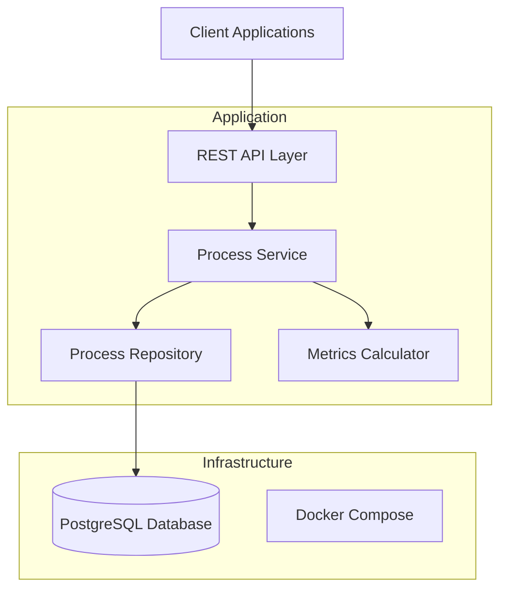

# Design Document

## Overview

The local-only Process API implements the core process tracking functionality for ToTrackIt Phase 0. This design focuses on creating a minimal implementation with PostgreSQL persistence that provides essential process lifecycle management with proper data durability. The API follows the existing OpenAPI 3.1 specification structure while simplifying authentication and namespace handling for local development.

The system enables developers to track asynchronous processes through their complete lifecycle: creation, monitoring, completion, and analysis. All data is persisted in PostgreSQL with proper database migrations and runs locally using Docker Compose for easy setup and development.

## Architecture

### High-Level Architecture



### Technology Stack

- **Framework**: Micronaut 4.x with Java 21
- **Database**: PostgreSQL 15+ with Flyway migrations
- **ORM**: Micronaut Data JDBC
- **Containerization**: Docker Compose for local development
- **Serialization**: Jackson for JSON processing
- **Validation**: Micronaut Validation with Bean Validation
- **Testing**: JUnit 5 with Micronaut Test and Testcontainers
- **Build**: Gradle with standard Micronaut conventions

### Simplified Design Decisions

For Phase 0 local-only implementation, several simplifications are made:

1. **No Authentication**: Removes API key validation and OAuth2 integration
2. **No Namespaces**: All processes exist in a single global namespace
3. **Local PostgreSQL**: Database runs in Docker container for easy setup
4. **Simplified Metrics**: Basic aggregations without time-series complexity
5. **Docker Compose**: Complete local development environment with one command

## Components and Interfaces

### REST API Layer

The API layer implements the following endpoints based on the existing OpenAPI specification:

#### Process Management Endpoints
- `POST /processes/{name}` - Create a new process
- `GET /processes/{name}/{id}` - Retrieve specific process details
- `PUT /processes/{name}/{id}/complete` - Mark process as completed
- `GET /processes` - List processes with filtering and pagination
- `GET /processes/metrics` - Query aggregated metrics

#### Request/Response Models

**Process Creation Request**:
```java
public class NewProcessRequest {
    @NotBlank @Size(min = 3, max = 50)
    private String id;
    
    @Min(0)
    private Long deadline; // Unix timestamp
    
    @Valid
    private List<ProcessTag> tags;
    
    private Map<String, Object> context;
}
```

**Process Response Model**:
```java
public class ProcessResponse {
    private String id;
    private String name;
    private ProcessStatus status;
    private DeadlineStatus deadlineStatus;
    private Long startedAt;
    private Long completedAt;
    private Long deadline;
    private List<ProcessTag> tags;
    private Map<String, Object> context;
    private Long duration; // calculated field
}
```

### Service Layer

#### ProcessService Interface
```java
@Singleton
public class ProcessService {
    public ProcessResponse createProcess(String name, NewProcessRequest request);
    public ProcessResponse getProcess(String name, String id);
    public ProcessResponse completeProcess(String name, String id, ProcessStatus status);
    public PagedResult<ProcessResponse> listProcesses(ProcessFilter filter, Pageable pageable);
    public ProcessMetrics getMetrics(MetricsFilter filter);
}
```

#### Key Service Responsibilities
- Process lifecycle management (create, complete, retrieve)
- Business rule validation (unique active processes, deadline calculations)
- Status and deadline status computation
- Filtering and pagination logic
- Metrics aggregation

### Repository Layer

#### Process Repository Design
```java
@Repository
public interface ProcessRepository extends CrudRepository<ProcessEntity, Long> {
    
    @Query("SELECT * FROM processes WHERE name = :name AND process_id = :processId")
    Optional<ProcessEntity> findByNameAndProcessId(String name, String processId);
    
    @Query("SELECT COUNT(*) FROM processes WHERE name = :name AND process_id = :processId AND status = 'ACTIVE'")
    boolean existsActiveProcess(String name, String processId);
    
    @Query("SELECT * FROM processes WHERE (:status IS NULL OR status = :status) " +
           "AND (:deadlineStatus IS NULL OR deadline_status = :deadlineStatus) " +
           "ORDER BY started_at DESC LIMIT :limit OFFSET :offset")
    List<ProcessEntity> findWithFilters(ProcessStatus status, DeadlineStatus deadlineStatus, 
                                       int limit, int offset);
}
```

#### Database Schema Strategy
- **Primary Key**: Auto-generated Long ID for database efficiency
- **Unique Constraint**: Composite unique constraint on (name, process_id, status) for active processes
- **Indexes**: Indexes on frequently queried columns (name, process_id, status, deadline)
- **JSON Support**: PostgreSQL JSONB for tags and context data

## Data Models

### Database Entity
```java
@Entity
@Table(name = "processes")
public class ProcessEntity {
    @Id
    @GeneratedValue(strategy = GenerationType.IDENTITY)
    private Long id;
    
    @Column(name = "process_id", nullable = false)
    private String processId;
    
    @Column(nullable = false)
    private String name;
    
    @Enumerated(EnumType.STRING)
    private ProcessStatus status;
    
    @Column(name = "started_at", nullable = false)
    private Instant startedAt;
    
    @Column(name = "completed_at")
    private Instant completedAt;
    
    @Column
    private Instant deadline;
    
    @Column(columnDefinition = "jsonb")
    private String tags; // JSON serialized
    
    @Column(columnDefinition = "jsonb")
    private String context; // JSON serialized
    
    // Computed properties
    public DeadlineStatus getDeadlineStatus();
    public Long getDuration();
    public boolean isOverdue();
}
```

### Service Layer Data Model
```java
public class Process {
    private String id;
    private String name;
    private ProcessStatus status;
    private Long startedAt;
    private Long completedAt;
    private Long deadline;
    private List<ProcessTag> tags;
    private Map<String, Object> context;
    
    // Computed properties
    public DeadlineStatus getDeadlineStatus();
    public Long getDuration();
    public boolean isOverdue();
}
```

### Enumerations
```java
public enum ProcessStatus {
    ACTIVE, COMPLETED, FAILED
}

public enum DeadlineStatus {
    ON_TRACK, MISSED, COMPLETED_ON_TIME, COMPLETED_LATE
}
```

### Filtering and Pagination
```java
public class ProcessFilter {
    private ProcessStatus status;
    private DeadlineStatus deadlineStatus;
    private Map<String, String> tags;
    private Long deadlineBefore;
    private Long deadlineAfter;
    private Integer runningDurationMin;
    private String sortBy;
}
```

## Error Handling

### HTTP Status Code Strategy
- **200 OK**: Successful retrieval operations
- **201 Created**: Successful process creation
- **400 Bad Request**: Validation errors, malformed requests
- **404 Not Found**: Process not found
- **409 Conflict**: Duplicate active process creation
- **500 Internal Server Error**: Unexpected system errors

### Error Response Format
```java
public class ErrorResponse {
    private String error;
    private String message;
    private Long timestamp;
    private String path;
    private List<ValidationError> details; // for validation errors
}
```

### Exception Handling Strategy
- **Global Exception Handler**: Centralized error response formatting
- **Validation Exceptions**: Detailed field-level error reporting
- **Business Logic Exceptions**: Custom exceptions for domain rules
- **Logging**: Structured logging for debugging and monitoring

## Testing Strategy

### Unit Testing
- **Service Layer**: Mock storage dependencies, test business logic
- **Storage Layer**: Test concurrent access patterns and data integrity
- **Validation**: Test all input validation rules and edge cases
- **Metrics**: Test aggregation calculations with various data sets

### Integration Testing
- **API Endpoints**: Full request/response cycle testing
- **Error Scenarios**: Validate error handling and status codes
- **Concurrent Access**: Multi-threaded testing for race conditions
- **Data Consistency**: Verify storage operations maintain consistency

### Test Data Strategy
- **Builder Pattern**: Fluent test data creation
- **Test Fixtures**: Reusable process data sets for different scenarios
- **Time Mocking**: Control time-dependent calculations for predictable tests

### Performance Considerations
- **Memory Usage**: Monitor in-memory storage growth during testing
- **Concurrent Performance**: Validate performance under concurrent load
- **Response Times**: Ensure sub-100ms response times for basic operations

## Database Design

### Database Schema

#### Processes Table
```sql
CREATE TABLE processes (
    id BIGSERIAL PRIMARY KEY,
    process_id VARCHAR(50) NOT NULL,
    name VARCHAR(100) NOT NULL,
    status VARCHAR(20) NOT NULL DEFAULT 'ACTIVE',
    started_at TIMESTAMP WITH TIME ZONE NOT NULL DEFAULT NOW(),
    completed_at TIMESTAMP WITH TIME ZONE,
    deadline TIMESTAMP WITH TIME ZONE,
    tags JSONB,
    context JSONB,
    created_at TIMESTAMP WITH TIME ZONE NOT NULL DEFAULT NOW(),
    updated_at TIMESTAMP WITH TIME ZONE NOT NULL DEFAULT NOW()
);

-- Unique constraint for active processes
CREATE UNIQUE INDEX idx_processes_unique_active 
ON processes (name, process_id) 
WHERE status = 'ACTIVE';

-- Performance indexes
CREATE INDEX idx_processes_name ON processes (name);
CREATE INDEX idx_processes_status ON processes (status);
CREATE INDEX idx_processes_deadline ON processes (deadline);
CREATE INDEX idx_processes_started_at ON processes (started_at);
```

### Migration Strategy

#### Flyway Migration Files
- **V1__Create_processes_table.sql**: Initial table creation
- **V2__Add_indexes.sql**: Performance indexes
- **V3__Add_constraints.sql**: Business rule constraints

#### Migration Naming Convention
- Version-based: `V{version}__{description}.sql`
- Repeatable: `R__{description}.sql` for views/functions
- Rollback: Manual rollback scripts in separate directory

### Docker Compose Configuration

#### docker-compose.yml
```yaml
version: '3.8'
services:
  postgres:
    image: postgres:15-alpine
    environment:
      POSTGRES_DB: totrackit
      POSTGRES_USER: totrackit
      POSTGRES_PASSWORD: totrackit
    ports:
      - "5432:5432"
    volumes:
      - postgres_data:/var/lib/postgresql/data
      - ./docker/postgres/init.sql:/docker-entrypoint-initdb.d/init.sql
    healthcheck:
      test: ["CMD-SHELL", "pg_isready -U totrackit"]
      interval: 10s
      timeout: 5s
      retries: 5

  app:
    build: .
    ports:
      - "8080:8080"
    environment:
      DATASOURCES_DEFAULT_URL: jdbc:postgresql://postgres:5432/totrackit
      DATASOURCES_DEFAULT_USERNAME: totrackit
      DATASOURCES_DEFAULT_PASSWORD: totrackit
    depends_on:
      postgres:
        condition: service_healthy
    volumes:
      - ./logs:/app/logs

volumes:
  postgres_data:
```

#### Application Configuration
```yaml
# application.yml
datasources:
  default:
    url: jdbc:postgresql://localhost:5432/totrackit
    username: totrackit
    password: totrackit
    driver-class-name: org.postgresql.Driver

flyway:
  datasources:
    default:
      enabled: true
      locations: classpath:db/migration

jpa:
  default:
    properties:
      hibernate:
        hbm2ddl:
          auto: validate
        show_sql: false
```

## Implementation Notes

### Deadline Status Calculation Logic
```java
public DeadlineStatus calculateDeadlineStatus() {
    if (deadline == null) return null;
    
    long now = Instant.now().getEpochSecond();
    
    if (status == ACTIVE) {
        return now > deadline ? MISSED : ON_TRACK;
    } else if (status == COMPLETED) {
        return completedAt <= deadline ? COMPLETED_ON_TIME : COMPLETED_LATE;
    }
    
    return null; // FAILED status
}
```

### Metrics Aggregation Approach
- **Real-time Calculation**: Compute metrics on-demand from current data
- **No Caching**: Simple implementation without optimization complexity
- **Percentile Calculations**: Use standard statistical methods for duration percentiles

### Database Considerations
- **Connection Pooling**: HikariCP for efficient connection management
- **Transaction Management**: @Transactional for data consistency
- **Unique Constraints**: Database-level enforcement of business rules
- **JSON Storage**: PostgreSQL JSONB for flexible tag and context storage
- **Performance**: Proper indexing strategy for common query patterns

### Development Workflow
1. **Start Environment**: `docker-compose up -d postgres`
2. **Run Migrations**: Automatic via Flyway on application startup
3. **Development**: Hot reload with Micronaut development mode
4. **Testing**: Testcontainers for integration tests with real PostgreSQL
5. **Reset Database**: `docker-compose down -v && docker-compose up -d postgres`