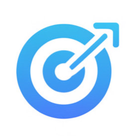
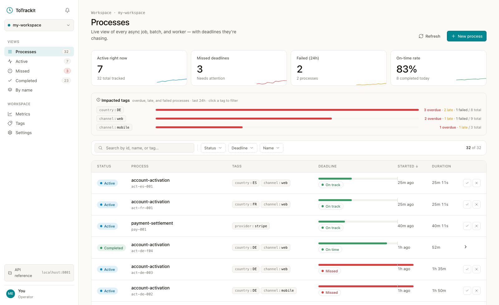
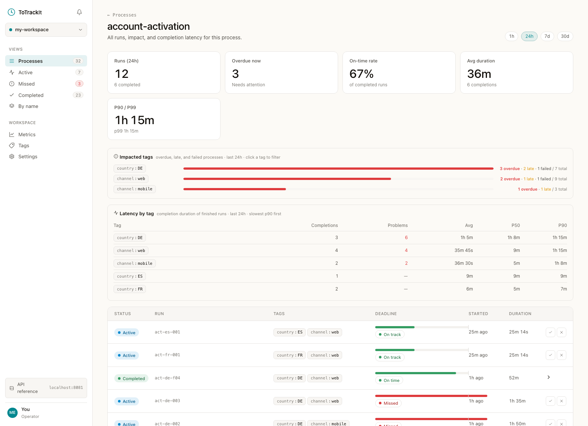

<p align="center">
  
</p>

<h1 align="center">ToTrackIt</h1>

<p align="center">
  <b>Open-source deadline tracking and root-cause analytics for asynchronous business processes.</b>
</p>

<p align="center">
  <a href="https://github.com/plein/ToTrackIt/actions/workflows/ci.yml"></a>
  <a href="https://github.com/plein/ToTrackIt/actions/workflows/publish-image.yml"></a>
  <a href="LICENSE"></a>
  <a href="https://openjdk.org/projects/jdk/21/"></a>
</p>

<p align="center">
  <a href="https://totrackit.com">Website</a> ·
  <a href="#-quick-start">Quick start</a> ·
  <a href="#-documentation">Docs</a> ·
  <a href="docs/metrics.md">Datadog & Prometheus guide</a> ·
  <a href="#%EF%B8%8F-roadmap">Roadmap</a>
</p>



## Why ToTrackIt

Every company runs async processes with implicit SLOs — account activations, payment settlements, KYC reviews, batch imports. When one silently gets stuck, the customer finds out before you do. ToTrackIt makes those processes first-class: register each run with two API calls (start + complete), give it a deadline, and you get real-time tracking, SLO metrics, and — the part your APM can't do — **root-cause analysis by business tags**.

**ToTrackIt is the diagnosis layer, not the pager.** Keep alerting in the stack you already trust: ToTrackIt exposes deadline-shaped Prometheus metrics that plug straight into Datadog monitors, Prometheus alerts, and metric-based SLOs. When an alert fires, its deep link lands on the process page in ToTrackIt — and the impacted-tags view tells you in one glance that all the stuck activations share `country:DE`, and that DE's p90 latency is 9× everyone else's.

```
your process ──2 API calls──▶ ToTrackIt ──/prometheus──▶ Datadog / Prometheus (alerting, SLOs)
                                  ▲                                  │ alert fires
                                  └────────── deep link ─────────────┘
                          "all problems are country:DE" — impacted tags, latency by tag
```

## ✨ Features

* **Process tracking & SLO deadlines** — register runs with IDs, deadlines, tags, and context; deadline status (`ON_TRACK`, `MISSED`, `COMPLETED_ON_TIME`, `COMPLETED_LATE`) is computed in real time.
* **Works with your alerting** — deadline-aware metrics (`overdue_current` gauge, missed/on-time/late counters) power stuck-process monitors and metric-based SLOs in Datadog, Prometheus, and Grafana. See the [metrics guide](docs/metrics.md).
* **Root cause by tags** — the impacted-tags view and `GET /analytics/tags` show which segment (`country`, `channel`, `provider`…) the overdue, late, and failed runs concentrate in, with completion latency (avg/p50/p90/p99) per tag.
* **Per-process pages & alert deep links** — every process name has a shareable page (`/?name=account-activation`) with a period picker, impact, and latency breakdowns; webhook alerts link straight to it.
* **Webhook notifications** — a JSON POST fires when a deadline is missed, carrying tags, context, and the dashboard deep link. See [notifications](docs/notifications.md).
* **Self-hosted & open source** — one Docker Compose file: API, UI, PostgreSQL. Java 21 + Micronaut. Apache 2.0.

Every process name gets its own page — runs, impact, and the per-tag latency table where slow segments stand out:



## 🚀 Quick start

```bash
git clone https://github.com/plein/ToTrackIt.git
cd ToTrackIt
docker-compose up --build
```

That starts the API (http://localhost:8080), Swagger UI (http://localhost:8081), and PostgreSQL. Track your first process:

```bash
curl -X POST "http://localhost:8080/processes/account-activation" \
  -H "Content-Type: application/json" \
  -d '{ "id": "run-001", "deadline": '$(($(date +%s)+3600))', "tags": [{ "key": "country", "value": "DE" }] }'

curl -X PUT "http://localhost:8080/processes/account-activation/run-001/complete" \
  -H "Content-Type: application/json" -d '{ "status": "COMPLETED" }'
```

For the web UI dev server, running from source, environment variables, and the monitoring stack, see [configuration & development](docs/configuration.md).

## 📖 Documentation

| Guide | What's in it |
|---|---|
| [API reference](docs/api.md) | Endpoints, examples, Swagger UI, OpenAPI spec |
| [Metrics, Prometheus & Datadog](docs/metrics.md) | Metric reference, alert examples, Datadog Agent config, SLO recipes |
| [Notifications](docs/notifications.md) | Deadline-missed webhooks and deep links |
| [Configuration & development](docs/configuration.md) | Environments, env vars, ports, running from source |
| [Database](docs/database.md) | Schema, useful queries, Flyway migrations |
| [Security](docs/security.md) | Deployment models, API key, reverse proxy |

## 💬 Community & support

* [GitHub Issues](https://github.com/plein/ToTrackIt/issues) — bugs and feature requests
* [GitHub Discussions](https://github.com/plein/ToTrackIt/discussions) — questions and ideas

## 🤝 Contributing

Contributions are welcome — see [CONTRIBUTING.md](CONTRIBUTING.md) for setup, tests, and conventions.

## 🗺️ Roadmap

### Done

* Core process API: create, get, list (filter/paginate), complete/fail, delete
* PostgreSQL with Flyway migrations; Docker Compose for dev and prod
* Observability: health endpoints, Prometheus metrics, Grafana/Alertmanager stack
* Web UI: dashboard, per-name process pages, tags, metrics
* Webhook notifications on missed deadlines (with dashboard deep links)
* Deadline-aware metrics for Prometheus/Datadog monitors and SLOs
* Tag-impact analytics with completion latency (avg/p50/p90/p99) overall and per tag
* Optional static API key

### Next (open-source core)

* Pre-deadline warning events (notify at e.g. 75% of the SLO, before the customer notices)
* Webhook signing (HMAC) and per-namespace webhook routing
* Time-series analytics (trends over time, not just windows)
* Email notification channel
* Helm chart / Kustomize for Kubernetes
* SDKs (Java/TS/Go)
* OpenTelemetry exporter

### Future (managed / enterprise)

* Namespaces & multi-tenancy
* Per-user API keys, admin API
* OAuth2/SSO (Cognito/Auth0)
* Slack/OpsGenie/Teams channels

## 📜 License

[Apache 2.0](LICENSE)

---

ToTrackIt was inspired by real-world experience at AWS, where teams struggled with visibility into async processes. Maintained by [Jordi Reina](https://www.linkedin.com/in/jordireina/).
